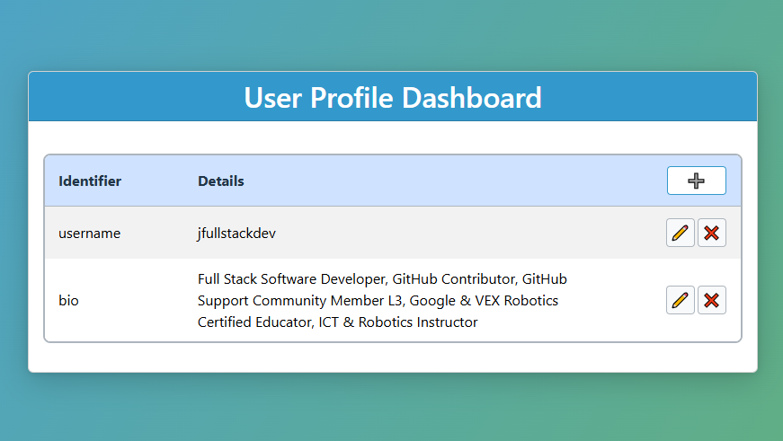

# Full-Stack MERN CRUD Sample



This is a template to create a full-stack MERN CRUD application.
It is a simple application that allows you to create, read, update,
and delete a list of items. It is a good starting point
for a full-stack MERN application.

Contrary to the popular MERN stack using MongoDB,
this template uses MySQL as the database.
This assumes that you need MySQL for your project, such as
if you need a lot of joins and connections among tables.

## Getting Started

### Using GitHub Codespaces

This project is configured to work seamlessly with GitHub Codespaces, allowing you to develop entirely in the browser without any local setup.

1. **Open in Codespaces**:

   - **Open a Codespace directly from GitHub:**
      - You can click the "Code" button on the
        repo page and select "Create codespace on main" (or another branch).
        No need to fork or clone first — GitHub will automatically provision a
        Codespace with the repo contents and devcontainer setup.
   - **Fork the repository:**
      - If you want your own copy of the repository (for making changes or
        keeping your own Codespace), fork it on GitHub, then open a Codespace
        from your fork.

2. **Setting up the Environment**:

   - Install all dependencies from the root directory:
     ```bash
     npm run install-all
     ```
   - Migrate the backend and whenever you need to refresh it:
     ```bash
     cd server && npx knex migrate:rollback --all && npx knex migrate:latest && npx knex seed:run && cd ..
     ```

3. **Run the Application**:

   From the root directory, run both frontend and backend:

   ```bash
   npm run dev
   ```

4. **Access the Application**:

   - The frontend application will be available on port 3000
     - Look for the "PORTS" tab in the bottom panel of VS Code
     - Right-click on port 3000
     - Select "Port Visibility" → "Public"
   - The application will now be accessible from your browser
   - Click on the "Open in Browser" button for port 3000 in the PORTS tab
   - The backend API is available on port 5000 (remains private as it's only accessed by the frontend)

   **Note:** From time to time, there can be odd behavior when forwarding
   ports like `3000`. Try a hard refresh, reopen the tab, or toggle the
   port visibility (e.g., switch between **Private** and **Public**)
   if it doesn't respond as expected.

5. **Optional - Run Services Separately**:

   To run only the backend:

   ```bash
   npm run backend
   ```

   To run only the frontend:

   ```bash
   npm run frontend
   ```

### Linting and Formatting

For each server and client folder you can run:

```
npm audit
npm run lint
npm run lint:fix
npm run format
```

### Local Development Setup

GitHub Codespaces config is already prepared and ready to run.
If you want to develop locally, you must manually install all dependencies and tools.

## Interacting with the Database

### Codespace Setup

In Codespaces, the **SQLTools** extension is included to simplify database interactions.
This extension allows you to easily connect to and manage MySQL (or other databases)
directly within VS Code, making it convenient for working in a cloud-based development environment.

Also, you can run the MySQL CLI to interact directly with the database.

## Full Stack Features

### Node.js as Backend API Server

As the usual backend server for a MERN stack application,
this template uses Node.js with Express.js as the backend API server.

### Express.js for Routing

Express.js is used for routing. This is considered the standard
for routing in Node.js.

### MySQL for Database

MySQL is used as the database. This is one of the most popular databases
for web applications. It is a relational database, in
contrast to MongoDB which is a NoSQL database.

### React.js for Frontend

React.js is used for the frontend. This is one of the most popular
frontend frameworks for web applications. It is a component-based
framework, in contrast to Angular which is an MVC framework.

### Knex.js for Query Builder

Knex.js is used as the query builder for MySQL. This is a popular
query builder for Node.js. It is in contrast to Sequelize, which is
an ORM for Node.js. Also, this almost looks like Laravel's query builder.

### Modular Approach

A modular approach is achieved by manually separating files
and folders appropriately. This is in contrast to Laravel,
which has a lot of files and folders out of the box, and
the NWidart Laravel Modules package, which has a modular
approach for Laravel.

### No Authentication

This template does not have authentication. This is because
the focus of this template is to show how to do CRUD in MERN.
Adding authentication is a different topic and will mostly
depend on your requirements or your team's/company's direction.

### No Input Validation & Sanitization

This template does not have input validation and sanitization.
Not all applications need validation and sanitization because
they add overhead to development. But if you need it,
or your team decides to add it, there are many packages
you can use to add this feature.

### No Unit Testing

This template does not have unit testing. This is because
the focus of this template is to show how to do CRUD in MERN.
Adding unit testing is a different topic and will mostly
depend on your requirements or your team's/company's direction.

## MERN vs Laravel

In my experience, they are almost similar in terms of the
development experience. The only difference is that Laravel
has a lot of features out of the box, while MERN has a lot of
packages that you can use to build your application. Meaning,
in MERN, you need to install them as you need them, while Laravel
by default already has these features.

For example, I started using Postman to test my endpoints.
I used the usual key-value pair to send data to the server in
the body. To my surprise, it did not work. I had to install
a package called body-parser to make it work. While in Laravel,
it works out of the box. Or in MERN, to avoid installing
body-parser, you can send data to the server
using JSON format.

Here is a more detailed comparison :

| **Feature**                 | **Laravel**                    | **MERN**                                 |
| --------------------------- | ------------------------------ | ---------------------------------------- |
| **Validation**              | ✅ Built-in                     | ❌ External libs (Joi, express-validator) |
| **Authentication**          | ✅ Built-in                     | ❌ Manual setup (JWT, Passport)           |
| **Authorization**           | ✅ Built-in (Gates & Policies)  | ❌ Custom logic                           |
| **Routing**                 | ✅ Clean, with middleware       | ✅ Express, manual middleware             |
| **Logging**                 | ✅ Monolog built-in             | ❌ Manual (Winston, Morgan)               |
| **ORM / DB Access**         | ✅ Eloquent (SQL)               | ✅ Mongoose (Mongo)                       |
| **Templating**              | ✅ Blade                        | ✅ JSX (React)                            |
| **CLI Tools**               | ✅ Artisan                      | ❌ Basic (npm/yarn scripts)               |
| **Sanitization**            | ⚠️ PHP functions/manual        | ❌ Mostly manual                          |
| **Migrations & Seeding**    | ✅ Built-in                     | ❌ Manual via ORM                         |
| **Queue System**            | ✅ Native support               | ❌ External setup (Bull, etc.)            |
| **Task Scheduling**         | ✅ Built-in Scheduler           | ❌ Cron + Libs                            |
| **Testing Framework**       | ✅ PHPUnit                      | ❌ Manual setup (Jest, Mocha)             |
| **Localization (i18n)**     | ✅ Built-in                     | ❌ Use external libs (i18next)            |
| **Events & Broadcasting**   | ✅ Native support (Echo)        | ❌ Custom (Socket.io)                     |
| **File Storage**            | ✅ Unified API                  | ❌ Manual (e.g. multer)                   |
| **API Resource Formatting** | ✅ With Resource classes        | ❌ Manual                                 |
| **Security Features**       | ✅ CSRF, rate limiting, hashing | ❌ Manual (helmet, bcrypt)                |
| **Official Ecosystem**      | ✅ Strong ecosystem             | ❌ Fragmented community libs              |

**Legend:**

* ✅ = Built-in / First-class support
* ❌ = Requires manual setup / External libraries
* ⚠️ = Possible, but partially manual or not first-class
